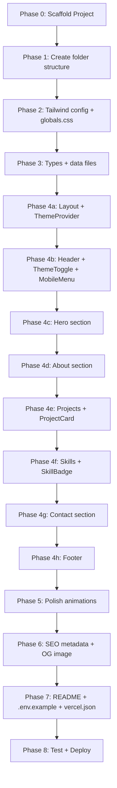

# Portfolio Website — Implementation Plan

**Owner:** Spandan Ghosh  
**Stack:** Next.js 14+ (App Router) · TypeScript · Tailwind CSS v3 · Vercel  
**Goal:** A production-ready, dark-mode-enabled, responsive portfolio that highlights full-stack capabilities.

---

## Phase 0 — Project Initialization

| Task | Detail |
|---|---|
| Scaffold project | `npx -y create-next-app@latest ./ --typescript --tailwind --eslint --app --src-dir --import-alias "@/*"` (non-interactive) |
| Install dependencies | `lucide-react` (icons), `framer-motion` (animations), `next-themes` (dark mode), `clsx` / `tailwind-merge` (className utils) |
| Dev dependencies | `@types/node`, `@types/react` (auto-included by create-next-app) |
| Verify dev server | `npm run dev` — confirm default page loads on `localhost:3000` |

---

## Phase 1 — File & Folder Structure

```
d:\Portfolio-website\
├── public/
│   ├── favicon.ico
│   └── og-image.png              # Open-Graph preview image (generated)
├── src/
│   ├── app/
│   │   ├── layout.tsx            # Root layout (fonts, metadata, ThemeProvider)
│   │   ├── page.tsx              # Landing page — assembles all sections
│   │   └── globals.css           # Tailwind directives + custom CSS variables
│   ├── components/
│   │   ├── Header.tsx            # Sticky nav + dark-mode toggle + mobile menu
│   │   ├── Hero.tsx              # Name, headline, CTA buttons
│   │   ├── About.tsx             # 2-3 paragraph developer bio
│   │   ├── Projects.tsx          # Grid of ProjectCards
│   │   ├── ProjectCard.tsx       # Individual project card component
│   │   ├── Skills.tsx            # Skills organized by category
│   │   ├── SkillBadge.tsx        # Individual skill pill/badge
│   │   ├── Contact.tsx           # Email, phone, LinkedIn, GitHub links
│   │   ├── Footer.tsx            # Copyright + social links
│   │   ├── ThemeToggle.tsx       # Dark/light mode switch button
│   │   ├── MobileMenu.tsx        # Slide-out mobile navigation
│   │   └── SectionWrapper.tsx    # Reusable section container with scroll animation
│   ├── data/
│   │   ├── projects.ts           # Project data array (typed)
│   │   ├── skills.ts             # Skills data grouped by category (typed)
│   │   └── personal.ts           # Name, bio, contact info, social links
│   ├── lib/
│   │   └── utils.ts              # `cn()` helper (clsx + tailwind-merge)
│   └── types/
│       └── index.ts              # Shared TypeScript interfaces/types
├── .env.example                  # Template for environment variables
├── .gitignore
├── next.config.mjs
├── tailwind.config.ts
├── tsconfig.json
├── vercel.json                   # (optional) Vercel deployment config
├── package.json
└── README.md
```

> [!NOTE]
> Using the **App Router** (`src/app/`) for modern Next.js patterns. All components are React Server Components by default; only components needing interactivity (Header, ThemeToggle, MobileMenu, SectionWrapper) will use `"use client"`.

---

## Phase 2 — Design System & Tailwind Config

### 2.1 Color Palette

| Token | Light Mode | Dark Mode | Usage |
|---|---|---|---|
| `--bg-primary` | `#FFFFFF` | `#0F172A` (slate-900) | Page background |
| `--bg-secondary` | `#F8FAFC` (slate-50) | `#1E293B` (slate-800) | Section alternating bg |
| `--bg-card` | `#FFFFFF` | `#1E293B` | Card surfaces |
| `--text-primary` | `#0F172A` | `#F1F5F9` (slate-100) | Headings |
| `--text-secondary` | `#475569` (slate-600) | `#94A3B8` (slate-400) | Body text |
| `--accent` | `#3B82F6` (blue-500) | `#60A5FA` (blue-400) | CTAs, links, highlights |
| `--accent-hover` | `#2563EB` (blue-600) | `#93C5FD` (blue-300) | Hover states |
| `--border` | `#E2E8F0` (slate-200) | `#334155` (slate-700) | Card borders, dividers |

### 2.2 Typography

| Element | Font | Weight | Size (desktop / mobile) |
|---|---|---|---|
| Headings | **Inter** (Google Fonts, `next/font`) | 700 | `3rem` / `2rem` |
| Sub-headings | Inter | 600 | `1.5rem` / `1.25rem` |
| Body | Inter | 400 | `1rem` / `0.9375rem` |
| Code / tech badges | **JetBrains Mono** (Google Fonts) | 500 | `0.75rem` |

### 2.3 Tailwind Config Customizations (`tailwind.config.ts`)

- Extend `colors` with the palette above using CSS variables
- Enable `darkMode: 'class'` for `next-themes` compatibility
- Add custom `fontFamily`: `sans` → Inter, `mono` → JetBrains Mono
- Add custom `animation` keyframes: `fade-up`, `fade-in`, `slide-in-left`, `slide-in-right`
- Add custom `boxShadow` for card hover effects
- Extend `screens` if needed (default Tailwind breakpoints are fine)

### 2.4 Global Styles (`globals.css`)

```
@tailwind base;
@tailwind components;
@tailwind utilities;

/* Smooth scrolling */
html { scroll-behavior: smooth; }

/* Custom scrollbar (subtle) */
/* Selection color */
/* CSS variable definitions for light/dark under :root and .dark */
```

---

## Phase 3 — Data Layer

### 3.1 Types (`src/types/index.ts`)

```typescript
interface Project {
  id: string;
  title: string;
  subtitle: string;          // e.g., "Full-Stack Django Web App"
  description: string;       // 2-3 sentences
  techStack: string[];
  githubUrl: string;
  liveUrl?: string;          // optional
  dateRange: string;         // e.g., "Sep – Oct 2024"
  highlights: string[];      // bullet points
}

interface SkillCategory {
  name: string;              // "Frontend", "Backend", etc.
  icon: string;              // Lucide icon name
  skills: string[];
}

interface PersonalInfo {
  name: string;
  title: string;
  location: string;
  email: string;
  phone: string;
  linkedinUrl: string;
  githubUrl: string;
  bio: string[];             // Array of paragraphs
  education: { institution: string; degree: string; dateRange: string };
}
```

### 3.2 Data Files

| File | Content |
|---|---|
| `personal.ts` | Name, title ("Full-Stack Developer"), location, contact info, bio paragraphs, education |
| `projects.ts` | Array of 3 `Project` objects: **Marevlo**, **IIITDM Alumni Connect**, **StudyWise** |
| `skills.ts` | 4 `SkillCategory` objects: **Languages**, **Frontend**, **Backend**, **Databases**, **Cloud & DevOps** |

> [!TIP]
> Keeping all content in typed data files makes future updates trivial — no digging through JSX.

---

## Phase 4 — Component Implementation

### 4.1 Layout & Providers (`src/app/layout.tsx`)

- Import `Inter` and `JetBrains Mono` from `next/font/google`
- Wrap children with `<ThemeProvider attribute="class" defaultTheme="dark" enableSystem>`
- Set `<html lang="en" suppressHydrationWarning>`
- Global `<head>` metadata: title, description, OG tags, favicon

### 4.2 Component Breakdown

#### `Header.tsx` (`"use client"`)

| Feature | Detail |
|---|---|
| Layout | Sticky top, blurred glass background (`backdrop-blur-md`), z-50 |
| Nav links | Home, About, Projects, Skills, Contact — smooth scroll via `href="#section-id"` |
| Active link | Track current section via `IntersectionObserver`, highlight active nav item |
| Dark mode toggle | `<ThemeToggle />` component using `next-themes` `useTheme()` |
| Mobile | Hamburger icon → `<MobileMenu />` slide-in overlay |
| Animation | Fade-in on mount, subtle shrink on scroll |

#### `Hero.tsx`

| Feature | Detail |
|---|---|
| Layout | Full viewport height (`min-h-screen`), centered content |
| Content | Greeting line ("Hi, I'm"), name (large, gradient text), title, 1-line tagline |
| CTAs | Two buttons: "View Projects" (filled, scrolls to `#projects`), "Contact Me" (outlined, scrolls to `#contact`) |
| Visual flair | Subtle animated gradient orbs/blobs in background (CSS or framer-motion), floating code-like decorative elements |
| Animation | Staggered fade-up for greeting → name → tagline → buttons |

#### `About.tsx`

| Feature | Detail |
|---|---|
| Layout | Two-column on desktop (text + decorative element), single column on mobile |
| Content | 2-3 paragraphs from `personal.bio`, education badge, experience summary |
| Visual | Decorative code block or terminal window showing a quick `whoami`-style snippet |
| Animation | Fade-up on scroll into view (via `SectionWrapper`) |

#### `Projects.tsx` + `ProjectCard.tsx`

| Feature | Detail |
|---|---|
| Layout | Section heading + responsive grid (`grid-cols-1 md:grid-cols-2 lg:grid-cols-3`) |
| Card design | Rounded corners, subtle border, hover: lift + glow shadow + border-accent transition |
| Card content | Title, subtitle, description (truncated), tech badges (colored pills), date range |
| Card footer | GitHub icon link + Live Demo link (if `liveUrl` exists) |
| Animation | Cards stagger fade-up on scroll |

**Tech badge color mapping** (in `ProjectCard.tsx`):
| Tech | Color |
|---|---|
| Python | `bg-yellow-500/10 text-yellow-600` |
| Docker | `bg-blue-500/10 text-blue-500` |
| AWS | `bg-orange-500/10 text-orange-500` |
| Django | `bg-green-700/10 text-green-700` |
| Flask | `bg-gray-500/10 text-gray-600` |
| React / Next.js | `bg-cyan-500/10 text-cyan-500` |
| SQLite | `bg-sky-500/10 text-sky-600` |
| JavaScript | `bg-yellow-400/10 text-yellow-500` |
| (default) | `bg-slate-500/10 text-slate-500` |

#### `Skills.tsx` + `SkillBadge.tsx`

| Feature | Detail |
|---|---|
| Layout | Section heading + grid of category cards (`grid-cols-1 sm:grid-cols-2 lg:grid-cols-4`) |
| Category card | Icon + category name + list of `SkillBadge` pills inside |
| Badge | Small rounded pill with tech name, subtle background, hover scale effect |
| Animation | Categories stagger fade-in on scroll |

#### `Contact.tsx`

| Feature | Detail |
|---|---|
| Layout | Centered section with heading + contact cards grid |
| Cards | Email (mailto: link), Phone (tel: link), LinkedIn (external), GitHub (external) — each with icon + label + value |
| Visual | Cards with hover lift effect, icons from `lucide-react` |
| CTA | "Let's work together" heading, optional "Send Email" button |
| Animation | Fade-up on scroll |

#### `Footer.tsx`

| Feature | Detail |
|---|---|
| Layout | Full-width, dark background (even in light mode for contrast) |
| Content | "© 2026 Spandan Ghosh. All rights reserved." + social icon links (GitHub, LinkedIn, Email) |
| Design | Minimal, clean divider line at top |

#### `SectionWrapper.tsx` (`"use client"`)

- Reusable wrapper that applies `framer-motion` viewport-triggered `fade-up` animation
- Props: `id` (for scroll targeting), `className`, `children`
- Uses `motion.section` with `whileInView` and `viewport={{ once: true, amount: 0.2 }}`

#### `ThemeToggle.tsx` (`"use client"`)

- Uses `useTheme()` from `next-themes`
- Sun/Moon icon swap with rotation animation
- Mounted check to prevent hydration mismatch

#### `MobileMenu.tsx` (`"use client"`)

- Full-screen overlay or slide-in drawer
- Same nav links as Header, closes on link click
- Animated open/close with `framer-motion` `AnimatePresence`

### 4.3 Page Assembly (`src/app/page.tsx`)

```tsx
// Server Component — no "use client" needed
export default function Home() {
  return (
    <main>
      <Header />
      <Hero />
      <About />
      <Projects />
      <Skills />
      <Contact />
      <Footer />
    </main>
  );
}
```

---

## Phase 5 — Animations & Interactions

### Framer Motion Strategy

| Animation | Trigger | Properties |
|---|---|---|
| **Fade Up** | Section scrolls into view | `initial={{ opacity: 0, y: 40 }}` → `animate={{ opacity: 1, y: 0 }}` |
| **Stagger Children** | Parent enters view | `staggerChildren: 0.1` in parent's `transition.variants` |
| **Card Hover** | Mouse enter | CSS `transform: translateY(-4px)` + `box-shadow` increase |
| **Nav link underline** | Hover / active | CSS `width` transition on pseudo-element |
| **Theme toggle** | Click | `rotate: 180` + icon swap |
| **Mobile menu** | Toggle | `x: "100%"` → `x: 0` slide |
| **Hero gradient orbs** | Continuous | CSS `@keyframes` float/pulse (no JS needed) |
| **Skill badge hover** | Mouse enter | `scale: 1.05` CSS transition |

> [!IMPORTANT]
> All scroll-triggered animations use `viewport={{ once: true }}` so they fire only once — this prevents janky re-animation on scroll-back and improves perceived performance.

---

## Phase 6 — SEO, Accessibility & Performance

### 6.1 SEO

| Item | Implementation |
|---|---|
| **Metadata** | Use Next.js `metadata` export in `layout.tsx` — title, description, OpenGraph, Twitter card |
| **Title** | `"Spandan Ghosh — Full-Stack Developer"` |
| **Description** | `"Full-stack developer specializing in Python, React, and cloud infrastructure. B.Tech CSE from IIITDM Jabalpur."` |
| **OG Image** | Generate a branded 1200×630 image using the `generate_image` tool |
| **Canonical URL** | Set via metadata once domain is known |
| **Robots** | Default allow-all |
| **Sitemap** | Not needed for single-page, but `robots.txt` can be added to `public/` |

### 6.2 Accessibility

| Requirement | Implementation |
|---|---|
| Semantic HTML | `<header>`, `<main>`, `<section>`, `<nav>`, `<footer>`, `<article>` for cards |
| Heading hierarchy | Single `<h1>` in Hero (name), `<h2>` per section, `<h3>` for card titles |
| Alt text | All images get descriptive `alt` attributes |
| ARIA labels | Theme toggle (`aria-label="Toggle dark mode"`), mobile menu button, external links (`aria-label`, `rel="noopener noreferrer"`) |
| Focus management | Visible focus rings (Tailwind `focus-visible:ring-2`), skip-to-content link |
| Color contrast | All text meets WCAG AA (4.5:1 minimum) — verified by palette choices |
| Keyboard nav | All interactive elements reachable via Tab, Escape closes mobile menu |

### 6.3 Performance

| Optimization | Detail |
|---|---|
| `next/font` | Self-hosted fonts — no layout shift, no external requests |
| Image optimization | `next/image` for any images (OG image, potential profile photo) |
| Code splitting | Automatic with App Router; `"use client"` only where needed |
| Bundle size | `lucide-react` tree-shakes; `framer-motion` adds ~30KB gzipped (acceptable) |
| Lighthouse target | 90+ across Performance, Accessibility, Best Practices, SEO |

---

## Phase 7 — Deployment Configuration

### 7.1 Files

| File | Purpose |
|---|---|
| `.env.example` | Template with comments — `# NEXT_PUBLIC_SITE_URL=https://your-domain.vercel.app` |
| `vercel.json` | Minimal — only if custom headers/redirects needed; otherwise Vercel auto-detects Next.js |
| `.gitignore` | Standard Next.js gitignore (auto-generated by create-next-app) |
| `README.md` | Setup instructions, tech stack overview, deployment guide |

### 7.2 README.md Structure

```
# Spandan Ghosh — Portfolio
## Tech Stack
## Getting Started
### Prerequisites (Node 18+, npm)
### Installation (clone, npm install, npm run dev)
### Environment Variables (copy .env.example)
## Deployment (Vercel)
### Steps: Import repo → auto-detect Next.js → deploy
## Project Structure (tree diagram)
## Customization Guide
## License (MIT)
```

### 7.3 Vercel Deployment Steps

1. Push code to GitHub
2. Import repository in Vercel dashboard
3. Vercel auto-detects Next.js — no config needed
4. Set environment variables (if any) in Vercel dashboard
5. Deploy — automatic on every push to `main`

---

## Phase 8 — Implementation Order (Task Sequence)



### Estimated File Count: **~20 files**
### Estimated Total Lines of Code: **~1500–2000 lines**

---

## Key Design Decisions

| Decision | Rationale |
|---|---|
| **App Router** over Pages Router | Modern Next.js standard; better RSC support, simpler layouts |
| **`next-themes`** for dark mode | Handles SSR hydration mismatch, localStorage persistence, system preference detection |
| **Framer Motion** over CSS-only animations | Viewport-triggered animations with `whileInView` are cleaner than IntersectionObserver + CSS classes |
| **Data files** instead of CMS/MDX | Overkill for 3 projects; plain TS files are the simplest, fastest approach |
| **No contact form** | Avoids backend/API complexity; direct email/LinkedIn links are more reliable |
| **Tailwind CSS v3** (user-requested) | Utility-first, dark mode via `class` strategy, great DX with TypeScript config |
| **Lucide React** for icons | Tree-shakeable, consistent style, MIT license, large icon set |
| **Single-page layout** | Portfolio content fits naturally in one scrollable page; no routing complexity |

---

> [!NOTE]
> This plan is ready for implementation. Once approved, I'll execute each phase sequentially, starting with project scaffolding and ending with deployment configuration.
